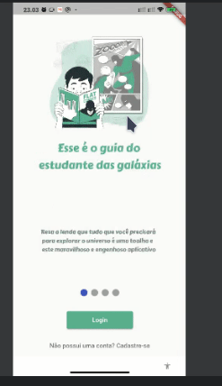

# App biblioteca pedagógica digital 

## 📖 Descrição

Este projeto se refere a um MVP de um aplicativo capaz de armazenar informações sobre livros didáticos e paradidáticos da Prefeitura de Arapiraca. A ideia do app surgiu de uma demanda do setor de TI da prefeitura que foi obtida a partir de conversas com o professor Maurício do IFAL Campus Arapiraca.

## 🛠️ Funcionalidades

- Cadastro de usuários
- Login de usuários
- Cadastro de livros

## 📡 Tecnologias utilizadas

 

  

  

## ⏳ Inicialização

Esse projeto foi desenvolvido utilizando o framework de desenvolvimento mobile [Flutter](https://flutter.dev/) e um banco de dados NoSQL Firestore do [Google Firebase](https://firebase.google.com/?hl=pt).

## 🤵🤵‍♀️ Colaboradores

Os colaboradores desse projeto foram eu (Eduardo Vítor) e [Tamilly Nascimento](https://github.com/tamilly).

 

## 🔎 Status do Projeto

 

## 📑 Referências

[Flutter](https://flutter.dev/)

[Google Firebase](https://firebase.google.com/?hl=pt)

